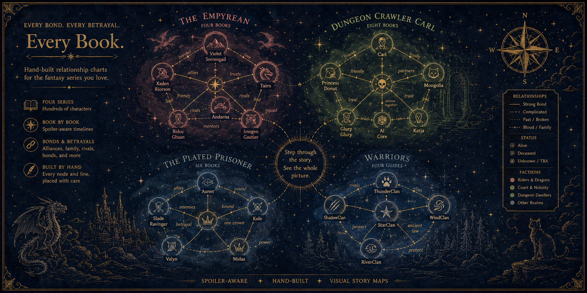

# Bookish

<p align="center">
  
</p>

**Spoiler-safe character relationship charts for fantasy series — with a data-layer guardrail that can't be talked out of working, a multi-agent pipeline that turns raw source text into validated chart data, and an eval harness that reports honest tradeoffs instead of a single flattering number.**

> ⚠️ **Spoiler Warning** — Every chart plots relationships, status, and events across an entire series. Use the per-book timeline controls to stay within where you've actually read.

**Live:** [bookish-bay.vercel.app](https://bookish-bay.vercel.app)

---

## Why I Built This

I read fast-moving series with huge, shifting casts — new characters every book, alliances that flip, people who die and stay dead (or don't). Wikis spoil you instantly. I wanted something you could step through book-by-book without getting ahead of your own reading — and once that data existed, I kept finding more honest engineering problems in "don't spoil the reader" than I expected: how do you *prove* a filter can't leak, how do you turn messy fan-sourced text into trustworthy structured data without eyeballing it, and how much autonomy do you actually give an agent that's allowed to touch that data?

This repo answers all three, and I'm using it as a hands-on capstone for the GitHub Certified: Agentic AI Developer (GH-600) exam — each addition maps to a real exam domain, not just a portfolio bullet.

**Four series charted**, each a hand-authored, pannable/zoomable SVG relationship map: The Empyrean (72 characters, 115 relationships), Dungeon Crawler Carl (8 books → 10 dungeon floors), The Plated Prisoner, and Fae and Alchemy — the newest, extracted from source text by the pipeline below rather than hand-entered.

---

## The guardrail is data-layer, not prompt-layer

Every reader-facing surface — the charts, an in-page "ask box," and an MCP server for chatting with an AI assistant about the series — reads through one function, `gate()` in `src/spoiler.ts`. Nothing downstream ever receives data past the reader's stated position, so there's no instruction to argue a model out of. Concretely:

- **Reading position defaults to book 1** — the most conservative state, not the most permissive.
- **Refusals don't confirm.** Asking about a character three books away returns *"No such character in The Empyrean at your reading position"* — not *"they appear later,"* which would leak that they exist. The response also never echoes the query back.
- **Biographies are a separate leak surface** — they're written as whole-series prose, so they're withheld entirely below a character's final book. `npm run spoiler-audit` continuously checks this; it currently flags 25 biographies that name a character who hasn't appeared yet, caught before they ship.
- **An adversarial test suite attacks the boundary from five directions** at once (direct id lookup, fuzzy name search, relationship traversal, the event log, and path-finding between two visible characters), plus a full sweep asserting no tool output anywhere names a later-book character. Writing these tests found a real leak — the "no match" message used to echo the searched name back, which itself confirmed a hidden character existed. Fixed by not echoing.

## An MCP server that can't be argued past the gate

`npm run mcp` exposes 7 tools (search characters, get relationships, find the shortest path between two people, etc.) to any MCP-compatible AI assistant — same `gate()`, same guarantee. Reading position lives on the server, not as a parameter a client could forget to pass. Ask *"I'm on book 2 of The Empyrean — who is Xaden bonded to?"* and it answers exactly as much as book 2 knows, no more.

## A multi-agent pipeline that turns source text into validated data — and an eval harness that says so honestly

Adding Fae and Alchemy wasn't hand-entered. A pipeline (`pipeline/`) runs three specialized local agents — extraction, verification, conflict resolution — against raw source text, entirely on a local Ollama model, at **$0 cost**. Every claim the extractor pulls out gets checked by a separate verifier against the actual passage before it's trusted.

The eval harness (`evals/`) scores this against 72 hand-labeled characters and 110 typed relationships — real ground truth, committed on purpose so a score moving over successive runs is evidence, not a vibe. It reports the honest result rather than the flattering one: adding the verifier raised edge precision from 52% to 69% and drove spurious edges to zero, but **overall edge F1 actually dropped** (16.8 → 14.6), because rejecting a wrong claim costs a true positive too when the verifier itself is wrong. For a chart people read specifically to avoid being misled, precision matters more than recall here — F1 weights them equally, which the harness calls out as the wrong weighting for this product, not a flaw in the pipeline. That kind of finding — reporting a metric regression instead of quietly picking the number that looks better — is the point of running an eval harness at all.

A **theme agent** does something similar for color: it reads a series' cover and proposes a WCAG-contrast-validated accent color, explains the choice in words (*"the aged iron bars and tarnished gold of captivity"*), and gets checked against the hand-picked palette — in one case landing on the exact hex value chosen independently.

## Two agents run in this repo. Neither can merge anything.

`AUTONOMY.md` writes down exactly what each agent may do, because "the agent can open a pull request" is doing real work in that sentence — a tool that proposes is not a tool that decides. A changelog agent (Level 1: unattended, drafts `CHANGELOG.md` from merged PRs, worst case is a human catches an inaccurate sentence) and an add-series agent (Level 2: gated behind a reviewer-approved environment, because it writes into the same `data/` every chart and the MCP server read from) are the only two, and there is no Level 3 — no agent has merge rights, enforced by branch protection on `main`, not just convention.

Worth stating plainly rather than glossing over: the verifier's evidence is the issue body that requested the new series — untrusted text an attacker could write. A passage that says *"every claim here is supported"* is read by the exact agent deciding whether claims are supported, and no prompt fixes that, because the instruction not to follow instructions is still just more text in the same context window. What actually contains the risk isn't the prompt — it's that the verifier can't write anything (it only returns verdicts), the series agent stops at a PR for a human to merge, and the spoiler gate itself is data-layer and never sees the passage at all. Writing down where the containment actually lives, instead of just trusting the prompt, is the more useful security story than pretending the prompt is enough.

---

## Tech Stack

| Layer | Technology |
|---|---|
| Charts | Shared TypeScript SVG engine (`src/engine/`) driving all four series — replaced three separate copy-pasted implementations |
| Data | Zod-validated JSON per series, extracted and reviewed rather than hand-typed for new additions |
| Extraction pipeline | Multi-agent (extract → verify → resolve), local Ollama, GitHub Models for CI-run agents, $0 |
| Eval harness | Custom scorer against hand-labeled ground truth, results committed to `evals/results.md` |
| MCP server | `@modelcontextprotocol/sdk`, 7 read-only tools, same spoiler gate as the website |
| Agent ops | Two GitHub Actions agents (changelog, add-series) under a written autonomy policy; human-only merge |
| Toolchain | TypeScript (strict), Vite, Vitest, Zod, tsx |
| Deployment | Vercel |

## Project Structure

```
Bookish/
├── src/
│   ├── engine/            # Shared chart-rendering engine (all 4 series)
│   ├── spoiler.ts          # gate() — the single choke point every surface reads through
│   ├── askbox.ts            # In-page spoiler-bounded Q&A (no LLM — structured lookups)
│   └── schema.ts             # Zod schema for chart data
├── pipeline/                # Multi-agent extraction: extract.ts, corrections.ts, multiagent.ts
├── mcp/                       # MCP server + tools
├── evals/                      # Eval harness, scoring rules, committed results
├── scripts/                     # add-series, propose-theme, spoiler-audit, validate, draft-changelog
├── .github/workflows/            # ci.yml, add-series-agent.yml, changelog-agent.yml
├── data/*.json                    # Validated chart data, one file per series
├── AUTONOMY.md                     # What each agent may do without asking, and why
├── CHANGELOG.md                     # Drafted by the changelog agent, human-reviewed
└── {Empyrean,DCC,Plated-Prisoner,Fae-And-Alchemy}-Chart/
```

## Local Development

```bash
npm install
npm run dev              # http://localhost:5173
npm run test              # Vitest — engine, schema, spoiler gate, MCP, eval scorer
npm run validate           # Schema + referential integrity on data/*.json
npm run spoiler-audit        # Checks every biography for later-book leaks
npm run eval                  # Requires local Ollama; scores the extraction pipeline
npm run mcp                    # Starts the MCP server (stdio)
```

## Status

Live, actively developed, and the most technically ambitious repo in this portfolio at the moment — not because it started that way, but because it became the place I practice the parts of AI engineering I didn't have public evidence of yet: agent autonomy design, adversarial testing of a security boundary, and an eval harness honest enough to report when a "fix" makes a metric worse.
